# HVRA System Architecture

```mermaid
graph TB
    subgraph Frontend["🎨 Frontend (React + Vite)"]
        Draw["Draw & Analyze<br/>MapView + Leaflet"]
        Explore3D["3D Explore<br/>MapboxDeckView + deck.gl"]
        HVIMap["HVI 2D Map<br/>Mapbox + Colors"]
        Heatmap["Heatmap & Drivers<br/>UTCI Grid + Vulnerabilities"]
        Interventions["Interventions<br/>What-if Engine + Toggle UI"]
        
        Utils["Utils<br/>hviColors.js<br/>interventionEngine.js<br/>solar.js"]
    end
    
    subgraph Backend["⚙️ Backend (FastAPI + Python)"]
        API["API Routes<br/>/api/urban/analyze<br/>/api/hvi/analyze_hvi<br/>/api/strategies"]
        
        subgraph Calculators["Calculation Layer"]
            HVICalc["HVI Calculator<br/>12-factor formula<br/>weights + composite"]
            UrbanAnalysis["Urban Analysis<br/>UTCI thermal sim<br/>Heatmap generation"]
            InterventionEngine["Intervention Engine<br/>Factor deltas<br/>Ranking & matching"]
        end
        
        subgraph DataLoaders["Data Loaders"]
            CatastroLoader["Catastro Loader<br/>WFS GetFeature<br/>Building years"]
            IdesatLoader["Idescat Loader<br/>Census tables<br/>Demographics"]
            SatelliteLoader["Satellite Loader<br/>Landsat LST<br/>Sentinel NDVI"]
            CensusLoader["Census Loader<br/>Income per section<br/>Demographic data"]
        end
    end
    
    subgraph DataSources["🛰️ Live Data Sources"]
        Catastro["Catastro INSPIRE<br/>WFS GetFeature<br/>Building footprints<br/>Construction years"]
        Idescat["Idescat API<br/>JSON-stat 2.0<br/>Census tables<br/>Demographics"]
        Landsat["Landsat 8/9 C2 L2<br/>Planetary Computer<br/>Surface temperature<br/>UHI delta"]
        Sentinel["Sentinel-2 L2A<br/>AWS Earth Search<br/>NDVI vegetation"]
        Infrared["Infrared SDK<br/>LOD1 geometry<br/>Building heights<br/>UTCI simulation"]
        OSM["OpenStreetMap<br/>Street network<br/>Green spaces<br/>Land use"]
        Renda["Barcelona Renda 2022<br/>Income per section<br/>CSV"]
    end
    
    subgraph UI["📊 UI Components"]
        HVIGauge["HVI Gauge<br/>Circular conic gradient"]
        RiskDist["Risk Distribution<br/>Stacked bar chart"]
        FactorBreakdown["Factor Breakdown<br/>12-factor bars"]
        DriverInfo["Driver Info<br/>Vulnerability cards"]
        InterventionCards["Intervention Cards<br/>Evidence + rankings"]
    end

    %% Frontend to Backend
    Draw -->|POST zone_geojson| API
    Explore3D -->|uses| HVIMap
    Interventions -->|toggleIntervention| Utils
    Interventions -->|applyInterventionsToZone| Utils

    %% Backend Routes
    API -->|calls| UrbanAnalysis
    API -->|calls| HVICalc
    
    %% HVI Calculator flow
    HVICalc -->|uses| CatastroLoader
    HVICalc -->|uses| IdesatLoader
    HVICalc -->|uses| SatelliteLoader
    HVICalc -->|uses| CensusLoader
    
    %% Urban Analysis
    UrbanAnalysis -->|uses| Infrared
    UrbanAnalysis -->|generates| Heatmap
    
    %% Data Loaders to Sources
    CatastroLoader -->|queries| Catastro
    IdesatLoader -->|queries| Idescat
    SatelliteLoader -->|queries| Landsat
    SatelliteLoader -->|queries| Sentinel
    CensusLoader -->|reads| Renda
    HVICalc -->|uses| OSM
    HVICalc -->|uses| Infrared
    
    %% Intervention Engine
    InterventionEngine -->|STRATEGIES| InterventionCards
    Utils -->|computeHVI| InterventionEngine
    
    %% Response back to Frontend
    HVICalc -->|buildings_with_hvi| Explore3D
    HVICalc -->|hvi_factors| HVIMap
    UrbanAnalysis -->|heatmap_image| Heatmap
    API -->|drivers| DriverInfo
    
    %% UI Components display
    HVIMap --> HVIGauge
    HVIMap --> RiskDist
    HVIMap --> FactorBreakdown
    Explore3D --> HVIGauge
    Explore3D --> FactorBreakdown
    Interventions --> InterventionCards
    Heatmap --> DriverInfo

    style Frontend fill:#e0f2fe
    style Backend fill:#fef3c7
    style DataSources fill:#dbeafe
    style Calculators fill:#fecaca
    style DataLoaders fill:#fbcfe8
    style UI fill:#c6f6d5
```

## Data Flow Summary

1. **User draws zone** → Frontend sends polygon to `/api/urban/analyze`
2. **Backend fetches geometry** → Infrared SDK for buildings, heights, UTCI grid
3. **Parallel data loads**:
   - Catastro: building years (via WFS)
   - Idescat: elderly%, income, isolation, AC access (census sections)
   - Landsat: LST, UHI delta (thermal via Planetary Computer)
   - Sentinel: NDVI (vegetation greenness)
   - OSM: street network, green spaces
4. **HVI Calculation** per building:
   - 12 factors from real data (0–1 scores)
   - Composite: `HVI = 10 × Σ(weight × score)`
   - Result: `hvi_score` + `hvi_factors` breakdown
5. **Frontend receives** buildings_geojson with HVI:
   - 3D explore: buildings colored by HVI, inspector shows 12-factor breakdown
   - Interventions tab: user toggles measures
6. **What-if simulation** (client-side):
   - Apply deltas to factors (intervention engine)
   - Recompute HVI instantly (no server call)
   - Rank interventions by zone-wide impact
   - Show before/after summary

## Key Technology Stack

| Layer | Tech | Purpose |
|-------|------|---------|
| **Frontend** | React + Vite | UI framework, dev server |
| **3D Viz** | deck.gl + Mapbox GL | Interactive buildings + basemap |
| **2D Viz** | Mapbox GL | HVI map view |
| **Geometry** | Turf.js, Shapely | Zone clipping, polygon ops |
| **Backend** | FastAPI + Python | REST API, calculation engine |
| **Thermal** | Infrared SDK | UTCI simulation, geometry |
| **Satellite** | Landsat C2 L2 (PC) | Surface temperature |
| **Vegetation** | Sentinel-2 (STAC) | NDVI index |
| **Building data** | Catastro INSPIRE WFS | Official cadastre |
| **Census** | Idescat JSON-stat API | Demographic tables |
