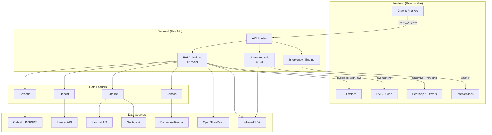

# HVRA — Heat Vulnerability Risk Analyzer

**Urban heat triage tool.** Draw a zone on a map of the city and, in about a minute, get a
building-level **Heat Vulnerability Index (HVI)** computed from live satellite, cadastral and
census data — visualized as color-coded 3D buildings over a street-level thermal heatmap.
Then toggle evidence-based design interventions, watch the buildings *and* the heat field
recolor live, read a **decision-gate verdict** on whether building-level retrofit is needed
at all, and export **auto-generated architectural drawings** (climatic section, intervention
plan, HVI waterfall, factor fingerprint) as SVG.

**Demo city: Barcelona.** The methodology is globally applicable — every data input sits
behind a swappable loader, satellite and OpenStreetMap inputs are already global, and
data-sparse cities can run on synthetic/surrogate defaults. See
[Global adaptability](#global-adaptability).

> **Positioning.** HVRA is *Layer 0* of a two-tool workflow: it is the diagnostic layer that
> decides **where** intervention is needed and **whether urban-scale measures are enough**.
> Zones (or single buildings) that stay above the risk gate after urban measures escalate to
> the building-level tool (Layer 1: IFC-based retrofit analysis; Layer 2: phone-scan workflow
> for buildings without IFC).

---

## Table of contents

1. [How it works — the pipeline](#how-it-works--the-pipeline)
2. [The HVI methodology](#the-hvi-methodology)
3. [Risk thresholds & the decision gate](#risk-thresholds--the-decision-gate)
4. [Data sources](#data-sources)
5. [The intervention engine](#the-intervention-engine)
6. [The what-if heatmap](#the-what-if-heatmap)
7. [Generated drawings](#generated-drawings)
8. [System architecture](#system-architecture)
9. [Tech stack](#tech-stack)
10. [Project structure](#project-structure)
11. [API](#api)
12. [Setup](#setup)
13. [Using the tool](#using-the-tool)
14. [Fallbacks & robustness](#fallbacks--robustness)
15. [Limitations (honest notes)](#limitations-honest-notes)
16. [Global adaptability](#global-adaptability)
17. [References](#references)

---

## How it works — the pipeline

When the user closes a polygon on the map, the backend runs this sequence:

1. **Geometry & microclimate** — the zone is sent to the **Infrared SDK**
   (api.infrared.city), which returns LOD1 building meshes (footprint + height) and runs a
   **UTCI thermal-comfort simulation** (July, 10:00–18:00) producing a street-level heat
   grid. Mesh triangles are unioned into clean georeferenced footprints (shapely
   `unary_union`), clipped to the drawn zone.
2. **Cadastre** — a WFS query to **Catastro INSPIRE** fetches official construction years;
   each analyzed building is matched to its cadastral record by centroid distance (~50 m).
3. **Satellite** — **Landsat 8/9 Collection-2 Level-2** thermal scenes (via Microsoft
   Planetary Computer, anonymous SAS) give land-surface temperature for the zone *and* the
   whole city from the same scene → the UHI delta. **Sentinel-2 L2A** (via AWS Earth
   Search) gives 10 m NDVI. Summer scenes with <10 % cloud are preferred.
4. **Census** — the zone is intersected with Barcelona's 1,068 **census sections**; for the
   intersecting sections the tool pulls % population 65+ (**Idescat** API), income per
   capita (Renda 2022 atlas), single-person households and dwellings without cooling
   (Census 2021).
5. **HVI computation** — each building gets 12 normalized factor scores (0–1) and the
   weighted composite (below). The response carries per-building `hvi_score`,
   `hvi_factors` (score + weight per factor) and `hvi_breakdown` (the three pillars).
6. **Client-side what-if** — everything after that (interventions, decision gate, drawings,
   heatmap re-rendering) happens instantly in the browser by re-evaluating the same
   formula with modified factor scores. No re-simulation, no server round-trips.

---

## The HVI methodology

### Composite formula

```
HVI = 0.15·age + 0.10·roof + 0.05·canyon + 0.05·green          (Building exposure · 35%)
    + 0.15·elderly + 0.10·income⁻¹ + 0.07·isolation
    + 0.05·no_AC + 0.03·disability                              (Social vulnerability · 40%)
    + 0.15·LST + 0.05·UHI + 0.05·NDVI⁻¹                         (Thermal context · 25%)
```

All 12 factors are normalized 0–1 (1 = most vulnerable); weights sum to 1.00; the HVI is
reported on a **0–10 scale per building** (**index points, not °C**). The structure follows
the exposure–sensitivity–adaptive-capacity framework of
[Reid et al. 2009](https://doi.org/10.1289/ehp.0900683).

### The 12 factors — normalization & source

| # | Factor | Weight | Normalization (→ 0–1) | Source |
|---|--------|--------|------------------------|--------|
| 1 | Construction era | 0.15 | Year bands: pre-1940 → 0.9 … post-2007 → 0.1 (older = worse envelope) | Catastro INSPIRE WFS |
| 2 | Roof type | 0.10 | Flat/dark roofs score high; estimated from OSM tags or era when untagged | OSM / era heuristic |
| 3 | Street canyon H/W | 0.05 | Height-to-width ratio of the adjacent street, capped | Infrared geometry + OSM streets |
| 4 | Green proximity | 0.05 | Distance to nearest green space: ≤50 m → 0.15, ≤100 → 0.45, ≤200 → 0.7, else 0.9 | OSM green polygons |
| 5 | % population 65+ | 0.15 | Section share / 25 % cap | Idescat (census-section) |
| 6 | Household income⁻¹ | 0.10 | Per-capita bands: <14 k€ → high … >23 k€ → low | Renda 2022 atlas (section) |
| 7 | Social isolation | 0.07 | % single-person households | Idescat Census 2021 |
| 8 | No air-conditioning | 0.05 | % dwellings without cooling system | Idescat Census 2021 (ceph) |
| 9 | Disability | 0.03 | 8 % city-level constant (no municipal API exists) | INE EDAD (static) |
| 10 | Land surface temperature | 0.15 | (LST − 30 °C) / 18 | Landsat 8/9 C2 L2 |
| 11 | UHI delta | 0.05 | (zone LST − city-mean LST) / 5 °C | Landsat, same scene |
| 12 | NDVI⁻¹ | 0.05 | 1 − NDVI / 0.5 | Sentinel-2 L2A, 10 m |

**Definitions** (spelled out in the UI glossary): HVI = Heat Vulnerability Index ·
LST = Land Surface Temperature · NDVI = Normalized Difference Vegetation Index ·
UTCI = Universal Thermal Climate Index ("feels-like" °C) · UHI = Urban Heat Island ·
H/W = street canyon height-to-width ratio.

**"Vulnerable time"** = share of simulated hours with **UTCI > 32 °C** (strong heat stress
on the ISB UTCI scale), July, 10:00–18:00. The simulation is a **static envelope** over
typical July conditions, not time-stepped.

---

## Risk thresholds & the decision gate

| HVI | Tier | Action |
|---|---|---|
| 0.0–4.0 | Low | No intervention needed |
| 4.0–5.5 | Moderate | Street-level measures recommended |
| 5.5–7.0 | High | Priority zone — urban + building measures |
| 7.0–10 | Critical | Immediate action — full retrofit pathway |

These thresholds live in **one place** (`frontend/src/utils/hviColors.js` →
`HVI_TIERS`, `SAFE_THRESHOLD = 4.0`, `BUILDING_GATE = 5.5`) and drive the legend, the
banner and the verdict.

**The decision gate** is the strategic core of the tool: urban-scale measures are applied
*first*, then the tool issues a verdict —

- zone drops **below 4.0** → *"urban measures sufficient, building-level retrofit not
  required"* ✓
- zone lands **4.0–5.5** → street measures recommended; building-level optional for the
  remaining outliers
- zone stays **≥ 5.5** → the N buildings above the gate **escalate to Layer 1**
  (building-level retrofit analysis)

This makes HVRA a *triage instrument*: it prevents spending on building retrofits where
neighborhood greening, shading and surfaces already bring risk to safe levels.

---

## Data sources

| Data | Source / endpoint | Resolution | Access |
|---|---|---|---|
| Building footprints & heights (LOD1) | Infrared SDK — api.infrared.city | per building | API key |
| UTCI thermal simulation | Infrared SDK | ~grid over zone | API key + credits |
| Construction year | Catastro INSPIRE WFS (`bu-core2d:beginning`) | per building | open, no key |
| Streets, green space, roof tags | OpenStreetMap (osmnx / Overpass) | feature level | open |
| % 65+, households, cooling | Idescat Taules v2 API (JSON-stat 2.0) — tables pmh/censph/ceph | census section | open |
| Income per capita 2022 | Barcelona Open Data / Idescat ADRH (renda CSV) | census section | open |
| Census section boundaries | Barcelona Open Data | 1,068 polygons WGS84 | open |
| Land surface temperature | Landsat 8/9 C2 L2 `lwir11` via Microsoft Planetary Computer (anonymous SAS) | 30 m (100 m native) | open |
| NDVI | Sentinel-2 L2A via AWS Earth Search STAC | 10 m | open |

Conversions worth knowing: Landsat LST = DN × 0.00341802 + 149.0 − 273.15 (°C); the UHI
delta compares the zone against the Barcelona bbox (2.05, 41.32, 2.25, 41.47) from the
**same scene** so atmospheric conditions cancel out.

---

## The intervention engine

**No AI guessing, no black box.** An intervention is a precise, evidence-based modification
of factor scores; the tool recomputes `HVI = 10 × Σ(weight × score)` and ranks by the drop.

### Catalog (10 measures)

Each entry in `frontend/src/data/interventionCatalog.js` declares:

- **`factorDeltas`** — `{set: x}` caps a factor at x (a coated roof behaves like a good
  roof); `{add: −x}` subtracts. Deltas can only *improve* a factor; results clamp to [0,1].
- **`applicable(factors)`** — per-building eligibility (cool roofs only on risky roofs,
  shelters only where elderly/isolation is high, deep retrofit only for pre-1980 stock…).
- **`evidence` + `source`** — the published cooling effect the delta is derived from.

| Measure | Category | Headline evidence |
|---|---|---|
| Cool / white roof coating | Building | up to −40 °C roof surface; −1.7 °C surface UHI @ 50 % coverage (IOP 2014) |
| Green roof (extensive) | Building | −28–30 °C roof surface; ~70 % cooling-load reduction |
| Street tree planting | Street | −2.6 °C air; −8.2 °C PET per tree; −0.13 °C LST per +10 % canopy (Nature Comms 2021) |
| De-paving + pocket greening | Street | Barcelona Eixample measured: 1 %→15 % permeable = −5 °C surface |
| Cool / reflective pavement | Street | −3 to −25 °C pavement surface (EPA) |
| Shade sails, pergolas & awnings | Street | −50 % mean radiant temperature; −5 to −15 °C UTCI at noon |
| Facade greening | Building | up to −9 °C facade; −0.5–1 °C nearby air |
| Deep envelope retrofit | Building | pre-1980 stock → modern-code overheating risk |
| Climate shelter (refugi climàtic) | Social | Barcelona's real network: 368 shelters by 2024 |
| Cooling access program | Social | targets the ~40 % of dwellings without cooling (Census 2021) |

### What-if math (`frontend/src/utils/interventionEngine.js`)

- `computeHVI(factors)` = clamp(10 × Σ w·s) — identical to the backend formula
- `applyInterventionsToZone` — applies the selected set to every eligible building,
  preserving `hvi_score_before`
- `rankInterventionsForBuilding` — top-3 recommendations in the 3D building inspector
- `rankInterventionsForZone` — the card ranking (mean zone ΔHVI + affected count)
- the **waterfall** applies measures cumulatively (biggest first) so each bar is a true
  *marginal* contribution — overlapping measures don't double-count, and the steps always
  sum exactly to the before→after difference

All intervention effects are reported in **HVI index points** (the UI says so explicitly —
they are not °C).

---

## The what-if heatmap

The step-1 UTCI heatmap is shown as a **ground underlay beneath the 3D buildings** (toggle +
opacity slider in the view controls) in both 3D Explore and Interventions tabs.

When interventions are toggled, the heat field updates live (`frontend/src/utils/heatmapWhatIf.js`):

- the backend ships the **raw UTCI grid** (downsampled ≤140×140, row 0 = south) alongside
  the rendered PNG
- the client applies **spatial deltas**: street cells — trees −2.6, shade −1.5, de-paving
  −1.5, cool pavement −1.0 °C; roof cells — cool roof −1.7 / green roof −1.2 °C, *only* on
  buildings where the catalog says the measure applies (point-in-polygon per cell)
- it re-renders with the **exact backend colormap** (`#0033cc → #0099ff → #ffffff →
  #ff6600 → #cc0000`) and the **original value scale**, so before/after colors are a true
  like-for-like comparison

---

## Generated drawings

Clicking **📐 Generate climatic diagrams** (Interventions tab, after selecting measures)
opens a sheet of four SVG-exportable drawings. Design principle: *every line encodes
computed data* — existing fabric in ink, proposals in blue/green.

### 1. Climatic section (`ClimaticSection.jsx` + `sectionGenerator.js`)

A vertical cut through the zone (S–N / W–E toggle + position slider):

- **building profiles** = real footprint chords × real LOD1 heights, drawn in **cut
  convention**: walls/slabs in solid poché, heavy cut outline, era-typical facade
  articulation from the Catastro year (pre-1980: tall windows, balconies, cornice; modern:
  band windows; storefront ground floors), level markers, street dimension lines with
  drafting ticks, sidewalk/curb marks, earth hatch, scale figures
- **shadows actually cast** from the computed solar position (NOAA-style formulas,
  Barcelona 41.4° N, June 21; presets 12:00 / 15:00 / 17:00 solar) projected onto the
  section plane
- **surface-temperature strip**: red curve = Landsat zone LST modulated by the computed
  shading (measured base); blue curve = with the selected interventions applied using the
  catalog coefficients
- **🌙 Night mode**: no sun; re-radiation arrows whose height encodes how freely stored
  heat escapes; nocturnal temperature curve where canyon retention scales with H/W after
  [Oke 1981](https://doi.org/10.1002/joc.3370010304) (UHImax ≈ 7.45 + 3.97·ln(H/W))
- title block states the honesty caveat: facade articulation is **typological by
  construction era**, not surveyed (LOD1 ceiling)

### 2. Intervention plan (`PlanDrawing.jsx` + `planGenerator.js`)

True-scale roof plan, north up, with the **section cut line A–A′** marked:

- roof treatments tinted only on **eligible** buildings; envelope retrofits haloed
- **street trees placed geometrically**: candidate grid filtered to 3–11 m from a facade,
  thinned to 9 m planting distance → trees line the streets like a planting plan
- de-paving / cool-pavement tint of the unbuilt space (zone minus footprints, even-odd)
- climate-shelter flag + dashed 300 m service radius; per-building HVI dots; north arrow,
  50 m scale bar, title block

### 3. HVI waterfall (`HVIWaterfall.jsx`)

Zone mean HVI cascading through each selected measure's **marginal** contribution
(cumulative application, biggest first), bars colored by category — the whole argument in
one strip, labeled "HVI index points, not °C".

### 4. Factor fingerprint (`FactorFingerprint.jsx`)

The 12 factors as a closed radar profile — red outline before, blue fill after. Shows
instantly *which kind* of vulnerability the package addresses and what it cannot touch
(physical measures don't move income).

---

## System architecture



The crucial architectural decision: **the what-if layer is fully client-side.** The backend
computes the expensive ground truth once (simulation, satellite, census); the browser owns
everything interactive (intervention math, decision gate, drawings, heatmap re-rendering).
That's what makes the demo instant.

---

## Tech stack

| Layer | Technology | Used for |
|---|---|---|
| Backend | Python 3.12 + FastAPI + uvicorn | REST API, orchestration |
| Geometry | shapely, numpy | mesh→footprint union, zone clipping, scoring |
| Microclimate | Infrared SDK (`infrared-sdk`) | LOD1 buildings, UTCI simulation |
| Satellite I/O | rasterio + STAC (Planetary Computer, Earth Search) | windowed COG reads of Landsat/Sentinel |
| OSM | osmnx | streets, green space, building tags |
| Rendering (server) | matplotlib (Agg) | UTCI heatmap PNG |
| Frontend | React 18 + Vite | SPA, five tabs |
| 3D | deck.gl (`GeoJsonLayer`, `BitmapLayer`) + Mapbox GL (dark-v11, interleaved) | extruded HVI buildings over heatmap underlay |
| 2D draw | Leaflet + leaflet-draw (light basemap) | zone drawing |
| Geo (client) | @turf/turf | point-in-polygon zone clipping |
| Drawings | hand-rolled SVG in React | section / plan / waterfall / fingerprint |
| What-if | pure JS (`interventionEngine`, `heatmapWhatIf`, `sectionGenerator`, `planGenerator`, `solar`) | instant recomputation |

---

## Project structure

```
urban-intervention-tool/
├── backend/
│   ├── app.py                          # FastAPI app, CORS, router mounting
│   ├── api/routes/
│   │   ├── urban.py                    #   POST /api/urban/analyze (geometry + UTCI + drivers)
│   │   ├── hvi.py                      #   POST /api/hvi/analyze_hvi (12-factor HVI)
│   │   └── strategies.py, zones.py, interventions.py, ifc.py
│   ├── services/
│   │   ├── urban_analysis.py           # Infrared orchestration, mesh→footprints, heatmap,
│   │   │                               #   raw-grid export, Landsat fallback
│   │   ├── hvi_calculator.py           # the 12-factor composite (weights, normalization)
│   │   ├── intervention_engine.py      # evidence-based strategy matching (API side)
│   │   └── data_loaders/
│   │       ├── catastro_loader.py      #   INSPIRE WFS, construction years
│   │       ├── idescat_loader.py       #   JSON-stat tables: elderly, households, cooling
│   │       ├── census_section_loader.py#   1,068 section polygons + Renda 2022 income
│   │       └── satellite_loader.py     #   Landsat LST + UHI, Sentinel-2 NDVI
│   └── data/
│       ├── census_sections_bcn_wgs84.json
│       ├── renda_2022_bcn.csv
│       └── zones/                      # cached Infrared zone responses
└── frontend/
    └── src/
        ├── App.jsx                     # tabs, pipeline overlay, decision gate, glossary
        ├── components/
        │   ├── MapView.jsx             #   draw tab (Leaflet + heatmap overlay)
        │   ├── MapboxDeckView.jsx      #   3D: deck.gl buildings + UTCI underlay + inspector
        │   ├── HVI2DMap.jsx            #   2D footprint map
        │   ├── FactorBreakdown.jsx     #   12-factor bars (weights chips)
        │   ├── DiagramSheet.jsx        #   diagram overlay: controls + 4 cards + SVG export
        │   ├── ClimaticSection.jsx     #   the section drawing
        │   ├── PlanDrawing.jsx         #   the intervention plan
        │   ├── HVIWaterfall.jsx        #   marginal-contribution strip
        │   └── FactorFingerprint.jsx   #   12-axis radar
        ├── data/interventionCatalog.js # 10 measures: deltas, applicability, evidence
        └── utils/
            ├── hviColors.js            # SINGLE SOURCE: colors, tiers, thresholds
            ├── interventionEngine.js   # computeHVI, apply, rank, summarize
            ├── heatmapWhatIf.js        # grid deltas + backend-identical colormap
            ├── sectionGenerator.js     # cut-line intersection, shadows, LST curves, night
            ├── planGenerator.js        # projection, tree placement, eligibility
            └── solar.js                # declination, sun position, section projection
```

---

## API

| Endpoint | Method | Body | Returns |
|---|---|---|---|
| `/health` | GET | — | `{status: "ok"}` |
| `/api/urban/analyze` | POST | `zone_geojson`, `center`, `size_m` | score, drivers, climate context, `simulation_grid` (heatmap PNG + raw values + bounds + min/max/unit), `buildings_3d` |
| `/api/hvi/analyze_hvi` | POST | `zone_geojson`, `center`, `include_thermal_analysis` | `buildings_with_hvi` (GeoJSON with `hvi_score`, `hvi_factors`, `hvi_breakdown`), `hvi_statistics`, data-source manifest |
| `/api/hvi/hvi_factors` | GET | — | factor/weight/source documentation |

The frontend calls `analyze` then `analyze_hvi` per drawn zone; everything else is local.

---

## Setup

### Prerequisites

- Python 3.12+, Node 20+
- An **Infrared** API key (api.infrared.city) — geometry + UTCI simulation
- A **Mapbox** token — basemaps

### Backend

```bash
cd backend
pip install -r requirements.txt
cp .env.example .env          # set INFRARED_API_KEY
python -m uvicorn app:app --host 0.0.0.0 --port 8000
```

### Frontend

```bash
cd frontend
npm install
cp .env.example .env          # set VITE_MAPBOX_TOKEN, VITE_API_BASE_URL=http://localhost:8000
npm run dev                   # http://localhost:5173
```

`.env` files are gitignored — never commit keys.

---

## Using the tool

1. **✏️ Draw & Analyze** — outline a few city blocks with the polygon tool; the analysis
   starts on close (first run fetches satellite scenes — up to a minute). A glossary and
   the live data-source chips are in the side panel.
2. **🧊 3D Explore** — buildings extruded at true height, colored by absolute HVI, over the
   UTCI heatmap underlay (toggle + opacity in view controls). Hover = quick readout; click
   = full 12-factor breakdown + top-3 recommended interventions for that building. The
   risk-tier legend shows which band the zone is in.
3. **🗺️ HVI Map** — 2D footprints, same single-source color scale, formula box with
   citations.
4. **🌡️ Heatmap & Drivers** — the UTCI heatmap image, climate context (peak/mean UTCI,
   vulnerable time, nocturnal retention), and the ranked vulnerability drivers with
   suggested actions.
5. **💡 Interventions** — toggle measures (cards ranked by zone impact, each with evidence
   and source link); buildings *and* heat field recolor live; before→after summary; the
   **decision gate** verdict updates; **📐 Generate climatic diagrams** exports the drawing
   sheet.

---

## Fallbacks & robustness

- **Infrared quota / 402** → the analysis automatically falls back to **real Landsat LST**
  (`thermal_source` flags it; heat-stress % derived from surface temperature; heatmap
  omitted). A 420 s `asyncio.wait_for` guards against hangs.
- **No raw grid** (older session) → the heatmap toggle still shows the original PNG; the
  what-if heatmap silently falls back.
- **Catastro/OSM gaps** → roof and era scores degrade to era-heuristics / neutral 0.5
  rather than failing.
- **matplotlib** runs under the `Agg` backend (thread-safe under uvicorn).
- Census section codes are built as `080193` + district(2) + section(3) and verified
  against the 2022 Renda atlas.

---

## Limitations (honest notes)

- **LOD1 geometry** — building detail in the drawings (windows, balconies, storefronts) is
  *typological by construction era*, not surveyed; the title block on every section says so.
- **Static simulation** — UTCI is a July-typical envelope, not time-stepped weather.
- **Disability factor** is a city-wide constant (8 %) — INE's EDAD survey has no
  municipal-level API.
- **Intervention deltas** translate published °C effects into 0–1 factor space —
  conservative, order-of-magnitude-correct, but judgment-based; measures are assumed
  independent (clamping bounds the error).
- **Applicability ≠ feasibility** — "applies to building X" means its factor profile
  qualifies, not that street width or structure was checked.
- The night-mode curve and the per-cell heatmap deltas are **models** (Oke 1981 canyon
  retention; catalog coefficients), clearly labeled as such in the drawings.

---

## Global adaptability

Barcelona is the demo case, not the product boundary:

- **Already global**: Landsat LST, Sentinel-2 NDVI, OpenStreetMap morphology, the Infrared
  simulation, the HVI formula, the entire intervention/what-if/drawing layer.
- **City-specific (swappable loaders)**: cadastre (`catastro_loader`), census demographics
  (`idescat_loader`), income atlas (`census_section_loader`). Each is an isolated module in
  `backend/services/data_loaders/` with a small interface — adapting a new city means
  implementing those three against local sources, or running on **synthetic/surrogate
  defaults** (era from OSM, demographics from national rasters like WorldPop) for
  data-sparse cities.
- Thresholds, weights, and the climate-shelter measure are configuration, not code.

---

## References

- Reid CE et al. (2009). *Mapping community determinants of heat vulnerability.*
  Environmental Health Perspectives 117(11). doi:10.1289/ehp.0900683
- Oke TR (1981). *Canyon geometry and the nocturnal urban heat island.* J. Climatology 1(3).
- Schwaab J et al. (2021). *The role of urban trees in reducing land surface temperatures
  in European cities.* Nature Communications 12, 6763.
- Macintyre HL & Heaviside C (2019); IOP (2014) — cool-roof surface-UHI coefficients.
- US EPA — *Using Cool Pavements to Reduce Heat Islands.*
- Barcelona City Council — Climate Shelters Network (refugis climàtics, 368 by 2024);
  Superblocks programme measurements; Eixample permeability pilot.
- ISB — UTCI assessment scale (operational thermal-stress categories).

---

*HVRA — IAAC Research Studio, Term III. Layer 0 of the heat-adaptation toolchain.*
